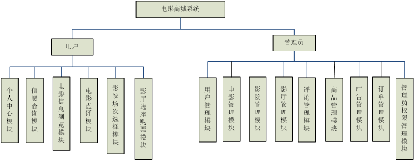
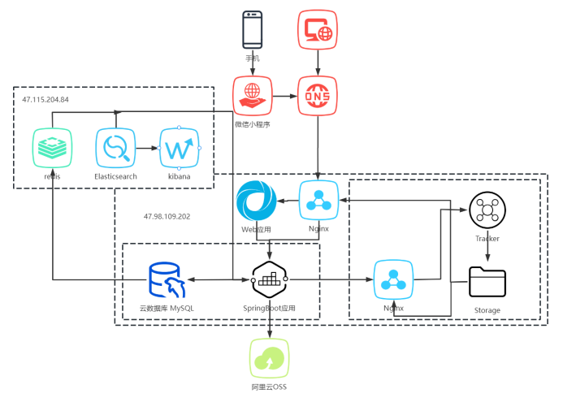
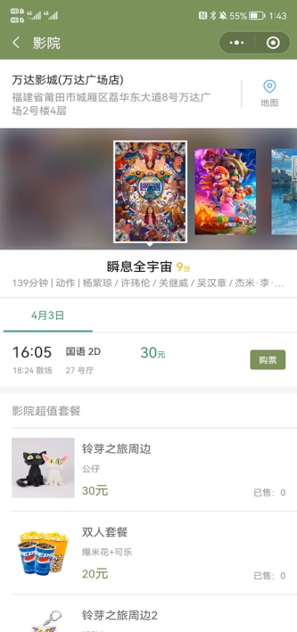
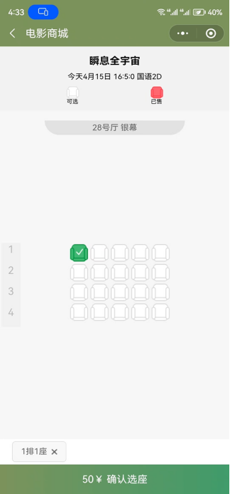

### weimai-wetapp

微麦电影购票小程序，分为三大部分：小程序端（weapp）、商家影院端（film_admin）、官方后台（file_back）
> 对与前面设计进行了一部分的改动，包括小程序图片存储在FastDFS、小程序视频存储在阿里云OSS、影院座位bug修复、Elasticsearch中的bug修复，Shiro添加了token

### 相关技术

- 前端：Vue、ElementUI
- 后端：SpringBoot、MyBatis、Druid、MySQL、Shiro、Elasticsearch、Redis

### 后端模块图

### 整体部署图

### 小程序效果图

  

